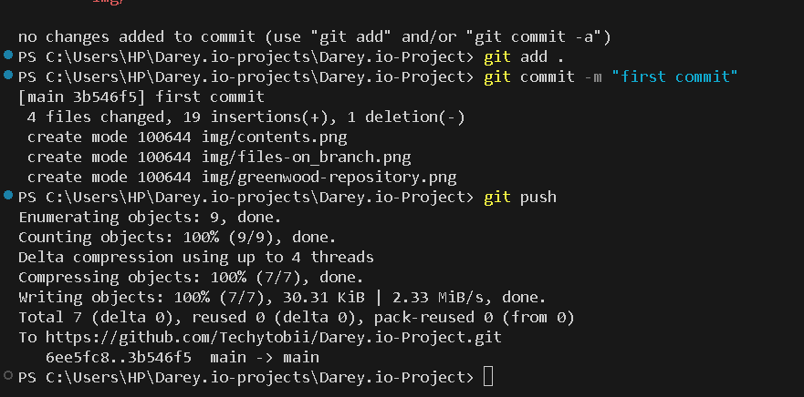

# GREENWOOD LIBRARY WEBSITE

> I cloned the reopsitory into my git bash

* 

****************

1. I created the following files on visual studio code and it's represented in the image below
>
* 

1. I added random contents to the files created above.
   * 
>
****************

I then staged, commit and pushed the changes directly to the main branch
 
>
# Morgan's Work

* I created a branch for Morgan named "add-book-reviews"
  
* I added a new file named "book_reviews.html"
 
* Theni pushed the add-book-reviews branch to github
  
  * then i rasied a PR for Morgan's work and merged it to the main branch.
   *
